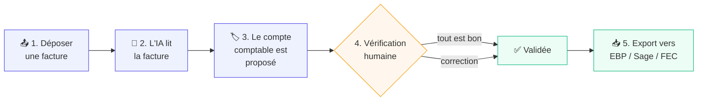
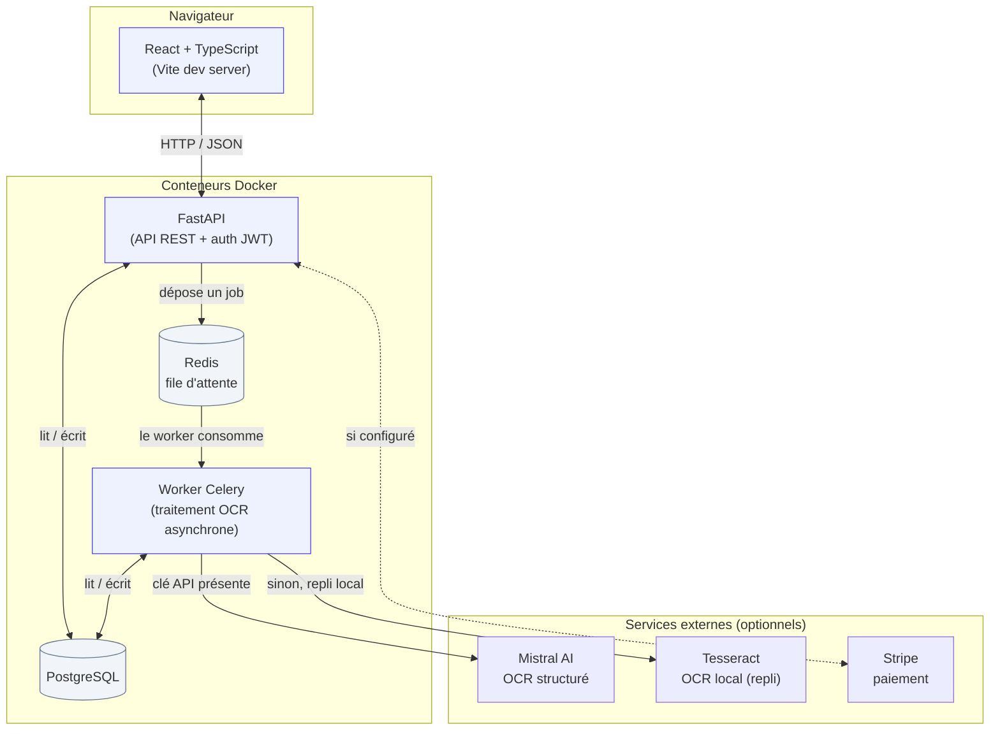
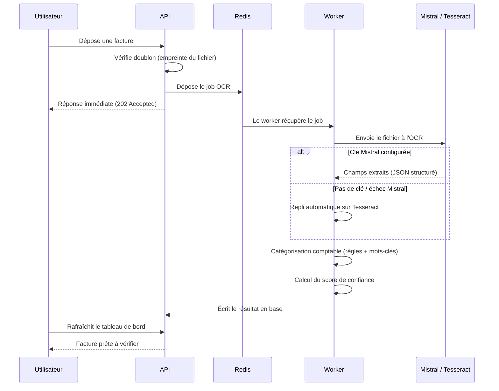

<div align="center">

# ComptaFlow

**Saisie automatique de factures pour cabinets d'expertise comptable**

[](https://github.com/valentinb78120-create/comptaflow/actions/workflows/ci.yml)
[](LICENSE)


*A French B2B SaaS that reads invoices with OCR, auto-categorizes them for French GAAP, and exports*
*accounting entries ready for the two most-used French accounting tools — try it locally in one command.*

</div>

---

## 🇫🇷 En une phrase, pour n'importe qui

Dans un cabinet comptable, quelqu'un passe des heures chaque semaine à **recopier à la main** les
informations d'une pile de factures (fournisseur, montant, TVA...) dans un logiciel de comptabilité.
**ComptaFlow automatise cette tâche** : on dépose une facture (PDF ou photo), le logiciel la lit tout
seul, propose la bonne catégorie comptable, et génère un fichier prêt à importer — la tâche qui prenait
10 minutes en prend 10 secondes.

C'est un projet SaaS complet que j'ai construit de bout en bout : back-end, front-end, base de données,
authentification, facturation par abonnement, et un back-office d'administration — pas une simple démo,
un produit qui pourrait réellement être vendu.

> 💡 **Vous ne connaissez rien à la compta ni au code ?** Ce README est écrit pour être compris sans
> prérequis. Chaque terme technique est expliqué la première fois qu'il apparaît.

---

## Table des matières

- [Démarrage en 3 minutes](#-démarrage-en-3-minutes)
- [Fonctionnalités](#-fonctionnalités)
- [Comment ça marche (pour tout le monde)](#-comment-ça-marche-pour-tout-le-monde)
- [Stack technique](#-stack-technique)
- [Architecture](#-architecture)
- [Pipeline OCR en détail](#-pipeline-ocr-en-détail)
- [Configuration](#-configuration)
- [Tests](#-tests)
- [Structure du projet](#-structure-du-projet)
- [API](#-api)
- [Décisions techniques & compromis](#-décisions-techniques--compromis)
- [Sécurité](#-sécurité)
- [Déploiement en production](#-déploiement-en-production)
- [Licence](#-licence)

---

## 🚀 Démarrage en 3 minutes

**Le seul pré-requis est [Docker Desktop](https://www.docker.com/products/docker-desktop/)** (gratuit,
Windows/macOS/Linux). Pas besoin d'installer Python, Node.js ou PostgreSQL sur votre machine — tout
tourne dans des conteneurs isolés.

```bash
git clone https://github.com/valentinb78120-create/comptaflow.git
cd comptaflow
docker compose up --build
```

C'est tout. Au premier lancement, Docker télécharge les images et installe les dépendances
(2-4 minutes selon votre connexion). Les fois suivantes, ce sera quasi instantané.

**Aucune clé API n'est nécessaire pour essayer l'application** : sans clé Mistral, l'OCR bascule
automatiquement sur un moteur local gratuit (Tesseract) — un peu moins précis, mais 100 % fonctionnel.
Voir [Configuration](#-configuration) pour brancher vos propres clés si besoin.

| Une fois démarré | URL |
|---|---|
| 🖥️ Application (React) | http://localhost:5173 |
| 🔌 API + documentation interactive | http://localhost:8000/docs |
| 🗄️ PostgreSQL (si vous voulez inspecter la base) | `localhost:5432` |

Les tables de la base de données sont créées **automatiquement** au premier démarrage (migrations
Alembic lancées par le conteneur lui-même) — aucune commande manuelle à taper.

Pour explorer sans créer de compte : sur l'écran de connexion, bouton **« Essayer sans compte »**
(mode démo, un cabinet fictif est créé pour vous).

<details>
<summary><b>Ça ne démarre pas ? Cliquez ici</b></summary>

- **« port already in use »** → un autre programme utilise déjà le port 5173, 8000 ou 5432. Arrêtez-le,
  ou changez le port dans `docker-compose.yml`.
- **Docker Desktop pas démarré** → ouvrez l'application Docker Desktop et attendez l'icône verte
  « Running » avant de relancer la commande.
- **Tout arrêter proprement** : `docker compose down` (ajoutez `-v` pour aussi effacer les données de
  test et repartir de zéro).

</details>

---

## ✨ Fonctionnalités

**Traitement des factures**
- 📤 Dépôt par glisser-déposer, PDF ou photo, plusieurs fichiers à la fois
- 🤖 Lecture automatique (fournisseur, date, montants HT/TVA/TTC, numéro de facture) via IA (Mistral)
  avec un **moteur de secours local** (Tesseract) si l'IA est indisponible ou non configurée
- 🏷️ Proposition automatique du compte comptable (36 règles standard + règles personnalisées par cabinet,
  activables/désactivables individuellement)
- ✅ Écran de validation humaine avant tout enregistrement définitif — aucune écriture douteuse ne
  part sans un œil humain
- 🔁 Détection de doublons (empreinte du fichier) et bouton « relancer l'OCR »

**Export comptable**
- 📄 Export CSV pour **EBP Compta** et **Sage 50**
- 📑 Export **FEC** (Fichier des Écritures Comptables), le format réglementaire exigé par
  l'administration fiscale française (article A47 A-1 du Livre des procédures fiscales)

**SaaS multi-clients**
- 🔐 Comptes avec mot de passe (JWT), isolation stricte des données par cabinet
- 💳 Abonnements à 4 paliers avec essai gratuit de 14 jours, intégration Stripe (paiement, webhooks,
  portail client)
- 📊 Quota d'usage mensuel appliqué automatiquement selon le palier souscrit
- 🛡️ Back-office d'administration : statistiques globales, gestion des cabinets, des essais, des plans

---

## 🎬 Comment ça marche (pour tout le monde)



**Pourquoi une vérification humaine à chaque fois ?** Parce que c'est de la comptabilité — une erreur
silencieuse coûte cher à un cabinet. Le logiciel ne remplace pas le comptable, il lui fait gagner le
temps de saisie et lui laisse le temps du contrôle.

---

## 🛠 Stack technique

| Domaine | Technologie | Pourquoi ce choix |
|---|---|---|
| **Backend** | Python 3.11 + [FastAPI](https://fastapi.tiangolo.com/) (async) | Typage fort (Pydantic), documentation Swagger générée automatiquement, très performant en async |
| **Base de données** | PostgreSQL 16 + [SQLAlchemy](https://www.sqlalchemy.org/) async + [Alembic](https://alembic.sqlalchemy.org/) | Fiabilité relationnelle, migrations versionnées et réversibles |
| **File d'attente** | [Celery](https://docs.celeryq.dev/) + [Redis](https://redis.io/) | L'OCR peut prendre 10-30 secondes : le traitement se fait en arrière-plan pour ne jamais bloquer l'utilisateur |
| **OCR / IA** | [Mistral AI](https://mistral.ai/) (extraction structurée) + [Tesseract](https://github.com/tesseract-ocr/tesseract) (repli local) | Précision maximale avec repli gratuit garantissant que le service ne tombe jamais en panne |
| **Frontend** | React 18 + TypeScript (strict) + [Vite](https://vitejs.dev/) | Développement rapide, typage de bout en bout avec le backend |
| **Style** | TailwindCSS (design system sur-mesure) | Cohérence visuelle, pas de CSS mort |
| **Données serveur** | [TanStack Query](https://tanstack.com/query) + [TanStack Table](https://tanstack.com/table) | Cache, re-fetch automatique, tableaux performants |
| **Paiement** | [Stripe](https://stripe.com/) (Checkout + Webhooks + Customer Portal) | Standard du marché pour la facturation SaaS |
| **Authentification** | JWT (PyJWT) + hachage bcrypt | Sans dépendance externe, contrôle total |
| **Tests** | Pytest (147 tests : unitaires + intégration) | Confiance dans les migrations, les calculs comptables et la sécurité |
| **Infrastructure** | Docker Compose (dev **et** prod) | Portable sur n'importe quelle machine, environnements identiques |
| **CI/CD** | GitHub Actions | Tests + builds vérifiés à chaque push |

---

## 🏗 Architecture



**Pourquoi un worker séparé de l'API ?** L'OCR peut prendre 10 à 30 secondes par facture. Si l'API le
faisait elle-même, l'utilisateur resterait bloqué à attendre. À la place : l'upload répond
immédiatement, le job part dans une file d'attente (Redis), un worker dédié le traite en arrière-plan,
et le frontend rafraîchit automatiquement l'écran dès que le résultat est prêt.

---

## 🔍 Pipeline OCR en détail



Le score de confiance détermine si la facture part directement en statut **« validée »** ou doit
repasser par un humain (**« à vérifier »**) — le seuil est volontairement strict : le moteur de secours
Tesseract, moins fiable, envoie **systématiquement** ses résultats en vérification humaine.

---

## ⚙️ Configuration

Le projet fonctionne **sans aucune configuration** grâce à des valeurs par défaut sûres pour le
développement. Pour activer les fonctionnalités optionnelles (OCR IA, paiement), copiez le fichier
d'exemple à la racine :

```bash
cp .env.example .env
```

| Variable | Rôle | Si laissée vide |
|---|---|---|
| `MISTRAL_API_KEY` | Clé de l'API OCR Mistral ([clé gratuite ici](https://console.mistral.ai)) | L'OCR utilise Tesseract (local, gratuit, un peu moins précis) |
| `STRIPE_SECRET_KEY` / `STRIPE_WEBHOOK_SECRET` / `STRIPE_PRICE_ID_*` | Paiement par abonnement | La facturation est simplement désactivée, l'essai gratuit reste utilisable |
| `APP_SECRET_KEY` | Clé de signature des sessions (JWT) | Une valeur de développement est fournie — à changer uniquement en production réelle |

Aucune de ces variables n'est nécessaire pour explorer l'application de bout en bout.

---

## 🧪 Tests

**147 tests** (unitaires + intégration bout-en-bout contre l'API réelle) :

```bash
docker compose exec api python -m pytest
```

| Ce qui est testé | Exemples de cas couverts |
|---|---|
| Catégorisation comptable | Priorité règles personnalisées > standard, frontières de mots, désactivation par cabinet |
| Extraction OCR | Formats de dates FR/EN, montants, taux de TVA, dégradation gracieuse sur texte vide |
| Exports comptables | Équilibre débit/crédit, encodages (UTF-8 / Latin-1 / ISO-8859-15), en-têtes réglementaires FEC |
| Authentification | Hachage bcrypt, signature/expiration JWT, isolation stricte entre cabinets (403 si accès croisé) |
| Facturation | Calcul du quota mensuel, blocage à la limite, changement de palier |
| Bout-en-bout | Inscription → upload → OCR (par le vrai worker) → correction → export, contre l'API démarrée |

La CI (GitHub Actions, badge en haut de page) relance cette suite à chaque `push`, plus le build
TypeScript strict du frontend et la construction des images Docker de production.

---

## 📁 Structure du projet

```
comptaflow/
├── backend/
│   ├── app/
│   │   ├── api/routes/         # Endpoints FastAPI (auth, invoices, billing, admin, pcg...)
│   │   ├── api/deps.py         # Résolution du cabinet courant (token JWT ou mode démo)
│   │   ├── core/
│   │   │   ├── config.py       # Configuration (variables d'environnement)
│   │   │   ├── security.py     # Hachage mots de passe + JWT
│   │   │   ├── plans.py        # Grille tarifaire et quotas
│   │   │   └── ratelimit.py    # Limitation de débit sur l'upload
│   │   ├── models/              # Tables SQLAlchemy (Invoice, Cabinet, PCGCustomRule...)
│   │   ├── schemas/             # Schémas Pydantic (validation entrée/sortie)
│   │   ├── services/
│   │   │   ├── mistral_ocr.py       # Appel API Mistral + extraction structurée
│   │   │   ├── tesseract_ocr.py     # Moteur OCR local de secours
│   │   │   ├── pcg_categorizer.py   # Moteur de règles → compte comptable
│   │   │   ├── exporter.py          # Génération CSV EBP / Sage 50 / FEC
│   │   │   ├── billing.py           # Intégration Stripe
│   │   │   └── siret.py             # Validation SIRET (algorithme de Luhn)
│   │   └── workers/celery_app.py    # Tâche OCR asynchrone
│   ├── alembic/versions/        # Historique des migrations de base de données
│   └── tests/                   # 147 tests pytest
│
├── frontend/
│   └── src/
│       ├── pages/                # Landing, Login, Register, Dashboard, Upload,
│       │                         # InvoiceDetail, Settings, Admin
│       ├── components/           # Layout, InvoiceTable, StatusBadge, Logo...
│       └── lib/
│           ├── api.ts            # Client HTTP typé (axios)
│           └── CabinetContext.tsx # Session (compte connecté ou mode démo)
│
├── docker-compose.yml           # Environnement de développement (portable, zéro config)
├── docker-compose.prod.yml      # Déploiement de production durci
└── .github/workflows/ci.yml     # Tests + builds automatiques
```

---

## 🔌 API

Documentation interactive complète (Swagger) sur **http://localhost:8000/docs** une fois le projet
lancé — chaque endpoint y est testable directement depuis le navigateur.

| Domaine | Endpoints principaux |
|---|---|
| **Authentification** | `POST /auth/register`, `POST /auth/login`, `GET /auth/me`, `POST /auth/change-password` |
| **Factures** | `POST /invoices/upload`, `GET /invoices/`, `PATCH /invoices/{id}`, `POST /invoices/{id}/export`, `POST /invoices/{id}/reprocess` |
| **Règles comptables** | `GET /pcg-rules/`, `POST /pcg-rules/custom`, `POST /pcg-rules/standard/toggle` |
| **Facturation** | `GET /billing/status`, `POST /billing/checkout-session`, `POST /billing/webhook` |
| **Administration** | `GET /admin/stats`, `GET /admin/cabinets`, `POST /admin/cabinets/{id}/set-plan` |

---

## 🧠 Décisions techniques & compromis

Quelques choix qui reflètent des arbitrages produit/technique délibérés :

- **Double moteur OCR (Mistral + Tesseract)** — un SaaS ne doit jamais tomber en panne parce qu'un
  fournisseur tiers est indisponible. Le repli local garantit un service fonctionnel à 100 % du temps,
  au prix d'une précision moindre (compensée par la vérification humaine obligatoire).
- **Traitement asynchrone (Celery + Redis)** plutôt que synchrone — l'OCR est lent ; bloquer une requête
  HTTP 30 secondes n'est pas acceptable en production.
- **Authentification duale (JWT *ou* mode démo)** — `resolve_cabinet_id()` accepte un token *ou* un
  identifiant de cabinet explicite, jamais les deux en désaccord (403 sinon). Permet un mode
  « essayer sans compte » sans dupliquer la logique métier.
- **Moteur de règles à trois niveaux** — règles personnalisées par cabinet > règles standard actives
  > aucune correspondance. Chaque cabinet peut désactiver une règle standard sans affecter les autres
  clients (`Cabinet.disabled_pcg_rules`, une clé stable par règle).
- **Quota mensuel calculé à la volée** — pas de compteur dénormalisé à maintenir en cohérence ; une
  requête `COUNT()` sur les factures du mois en cours suffit et reste simple à auditer.
- **Détection de doublons par empreinte de fichier** (SHA-256) plutôt que par nom — un fichier renommé
  reste détecté, un fichier différent au même nom ne déclenche pas de faux positif.
- **Migrations avec `server_default` systématique** — ajouter une colonne `NOT NULL` sur une table déjà
  peuplée échoue sans valeur par défaut explicite ; appris à la dure sur ce projet, désormais
  systématique sur toute nouvelle migration.

---

## 🔒 Sécurité

- Mots de passe hachés avec **bcrypt** (jamais stockés en clair)
- Sessions **JWT** signées, expiration à 7 jours
- **Isolation stricte multi-cabinet** : un token ne peut jamais lire les données d'un autre cabinet
  (testé explicitement — tentative croisée → `403 Forbidden`)
- **Limitation de débit** sur l'upload (anti-abus)
- Validation stricte des entrées (Pydantic) à chaque endpoint
- Aucun secret commité : `.gitignore` exclut tous les fichiers `.env`

---

## 🚢 Déploiement en production

Un second fichier, `docker-compose.prod.yml`, est fourni pour un déploiement durci (workers multiples,
secrets obligatoires — le démarrage échoue explicitement si un mot de passe n'est pas défini, base de
données non exposée publiquement, frontend compilé et servi par Nginx). Il n'est pas nécessaire pour
explorer le projet en local.

---

## 📄 Licence

Ce projet est sous licence [MIT](LICENSE) — libre d'utilisation, de modification et de redistribution.

---

<div align="center">

**Développé par [Ton Nom]** — [LinkedIn](#) · [Portfolio](#) · [Contact](#)

*N'hésitez pas à cloner le projet, à ouvrir une issue ou à me contacter pour en discuter.*

</div>
